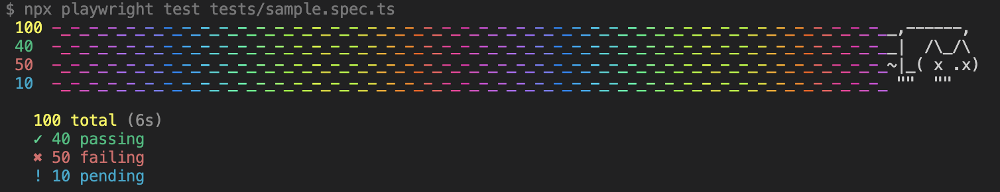

# @alex_neo/playwright-nyan-reporter

   

Nyan reporter for Playwright Test



## Description

This project provides a Nyan Cat-themed reporter for Playwright Test. It visually represents test results in a fun and colorful way.

## Installation

To install the reporter, run:

```bash
npm install @alex_neo/playwright-nyan-reporter
```

# Usage

To use the Nyan reporter in your Playwright tests, configure it in your playwright.config.ts file:

## Usage

To use the Nyan reporter in your Playwright tests, configure it in your `playwright.config.ts` file:

```ts
import type { PlaywrightTestConfig } from '@playwright/test';
import { NyanReporterOptions } from '@alex_neo/playwright-nyan-reporter';

const config: PlaywrightTestConfig = {
  testDir: './tests',
  timeout: 30 * 1000,
  expect: {
    timeout: 5000,
  },
  fullyParallel: true,
  forbidOnly: !!process.env.CI,
  retries: process.env.CI ? 2 : 0,
  workers: '50%',
  reporter: [
    '@alex_neo/playwright-nyan-reporter',
    {
      suppressErrorReporter: true,
      renderOnRunCompletely: false,
    } as NyanReporterOptions,
  ],
  use: {
    actionTimeout: 0,
    trace: 'on-first-retry',
  },
};

export default config;
```

## Options

The Nyan reporter supports the following options:

- `suppressErrorReporter`: (boolean) Suppresses error reporting if set to `true`. Default is `true`.
- `renderOnRunCompletely`: (boolean) Renders the reporter output completely on run. Default is `false`.

## License

This project is licensed under the MIT License. See the `LICENSE` file for details.

## Contributing

Contributions are welcome! Please open an issue or submit a pull request.

## Acknowledgements

This project is inspired by the [Nyan Cat reporter for Mocha](https://www.npmjs.com/package/jest-nyan-reporter).

---

Enjoy your colorful test results with the Nyan reporter! 😺🌈
